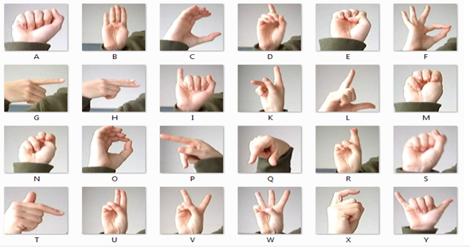

# GANs with Hands

This repository contains a Jupyter Notebook, **GANs with Hands**, which explores the implementation and training of Generative Adversarial Networks (GANs) specifically tailored for generating realistic hand images.

## Overview

The notebook demonstrates the following key topics:
1. **Data Preprocessing**: Techniques for preparing datasets containing hand images.
2. **Model Architecture**: Building and understanding the generator and discriminator networks of a GAN.
3. **Training Process**: Implementation of GAN training loops and techniques for stabilizing training.
4. **Visualization**: Visual analysis of generated outputs at various training stages.
5. **Evaluation**: Methods to evaluate the quality of generated hand images.

## Dependencies

The notebook relies on the following libraries and frameworks:
- Python 3.x
- TensorFlow/Keras
- NumPy
- Matplotlib
- PIL (Python Imaging Library)

Ensure all dependencies are installed to run the notebook smoothly.

## Getting Started

1. Clone this repository to your local machine:
   ```bash
   git clone https://github.com/yourusername/GANs-with-Hands.git
   ```

2. Install the required Python packages:
   ```bash
   pip install -r requirements.txt
   ```

3. Open the Jupyter Notebook:
   ```bash
   jupyter notebook "GANs with Hands.ipynb"
   ```

## Results

The notebook showcases:


- Generated hand images after specific training epochs.
- Loss curves for both generator and discriminator during training.

## Usage

This notebook serves as an educational resource for those looking to understand GANs and their application to specific domains like image generation. You can adapt the code for other datasets and purposes.

## License

This project is licensed under the MIT License. See the LICENSE file for more details.

---

Happy coding! 🚀
